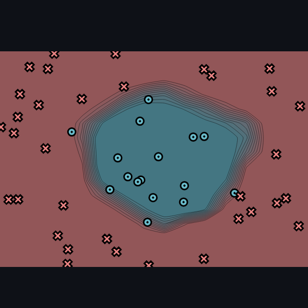

[](https://classroom.github.com/online_ide?assignment_repo_id=16888122&assignment_repo_type=AssignmentRepo)
# MiniTorch Module 1


* Docs: https://minitorch.github.io/

* Overview: https://minitorch.github.io/module1/module1/

This assignment requires the following files from the previous assignments. You can get these by running

```bash
python sync_previous_module.py previous-module-dir current-module-dir
```

The files that will be synced are:

        minitorch/operators.py minitorch/module.py tests/test_module.py tests/test_operators.py project/run_manual.py

## Task 1.5: Training

### DATASET = minitorch.datasets\["Simple"\](PTS)
PTS = 50  
HIDDEN = 2   

RATE = 0.1  
EPOCHS = 100  


### DATASET = minitorch.datasets\["Diag"\](PTS)
PTS = 50  
HIDDEN = 2   

RATE = 0.1  
EPOCHS = 300  


### DATASET = minitorch.datasets\["Split"\](PTS)
PTS = 50  
HIDDEN = 2   

RATE = 0.1  
EPOCHS = 300  


### DATASET = minitorch.datasets\["Xor"\](PTS)
PTS = 50  
HIDDEN = 2   

RATE = 0.1  
EPOCHS = 400  


### DATASET = minitorch.datasets\["Circle"\](PTS)
PTS = 100  
HIDDEN = 10   

RATE = 0.1  
EPOCHS = 500  




<!-- ### DATASET = minitorch.datasets\["Spiral"\](PTS)
PTS = 100  
HIDDEN = 2   

RATE = 1.0  
EPOCHS = 500  

  -->
